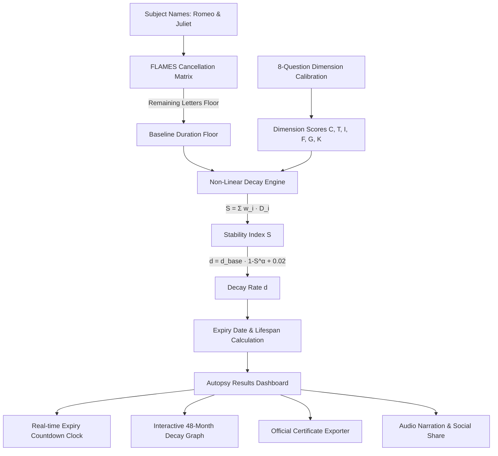

# DEFLAMES 🔥🎯

> **The Automated Quantum Relationship Autopsy Engine & Expiry Predictor.**

---

## Basic Details

### Team Name: ASTRA

### Team Members
- **Member 1:** ADITH S KUMAR
- **Member 2:** SOORAJ

### Project Description
DEFLAMES is a satirical, mathematical relationship half-life simulator and autopsy engine. By combining the nostalgic childhood FLAMES letter-canceling matrix with 6-dimensional relationship decay physics, it calculates the exact expiration date, remaining lifespan countdown, breakup probability, and forensic grounds for inevitable romantic separation.

### The Problem (that doesn't exist)
Couples spend years dating under the blissfully ignorant illusion of eternity, completely unaware of their relationship's thermodynamic expiration timestamp. Traditional childhood FLAMES only gave you a single letter (`L`, `M`, `E`...) without providing an exact calendar deadline, a scientific decay curve, or an actionable habit patch.

### The Solution (that nobody asked for)
DEFLAMES mathematically dissects relationships using non-linear differential decay calculations. It diagnoses 6 key vulnerability dimensions ($C$ommunication, $T$ime, $I$ntimacy, $F$inances, $G$oals, and $K$onflict resolution), generates a responsive 48-month decay trajectory curve, exposes the primary reasons you will break up over unwashed spoons and Netflix passwords, and issues an officially signed, downloadable **Certificate of Relationship Expiry**.

---

## Technical Details

### Technologies/Components Used

#### For Software:
- **Languages:** JavaScript (ES6+ / Node.js runtime)
- **Frontend Frameworks:** React 19, Vite 8, Tailwind CSS v4
- **Backend Framework:** Express.js, Node.js HTTP & Test Runner
- **Libraries:**
  - `lucide-react` (Neo-brutalist icons & UI badges)
  - `canvas-confetti` (Celebratory breakup confetti cannon)
  - `html-to-image` (High-res PNG certificate generation & export)
  - `cors` (Cross-origin API orchestration)
- **Tools & Platforms:** VS Code, Antigravity IDE, Headless Chromium, Vercel Serverless

#### For Hardware:
- *Not Applicable (100% Software & Heartbreak Engineering)*

---

### Implementation

#### For Software:

```bash
# Clone the repository
git clone https://github.com/CipherX-Adith/deflame2.0.git
cd deflame2.0

# Install all root, server, and client dependencies
npm run install:all
```

#### Run:

```bash
# Run both Frontend (Vite) and Backend (Express) concurrently in Development Mode
npm run dev

# Or run Production Build & Server
npm run build
npm start
```
- **Web UI:** `http://localhost:5173` (or `http://localhost:5000` in production)
- **API Endpoint:** `http://localhost:5000/api/deflames`

---

## Project Documentation

### For Software:

#### Screenshots

##### 1. Subject Ingestion & Calibration Protocol

*The neo-brutalist subject selection interface where Subject A and Subject B enter their names, configure audio SFX, and initiate the diagnostic autopsy protocol.*

---

##### 2. 8-Question Forensic Examination

*Interactive diagnostic exam assessing 6 core dimensions ($C, T, I, F, G, K$) with real-time calibration progress.*

---

##### 3. Relationship Autopsy Report & Live Expiration Clock

*The core autopsy verdict displaying remaining lifespan (e.g. 12 months 11 days), real-time ticking expiration countdown, breakup probability gauge, and primary grounds of separation.*

---

##### 4. 6-Dimension Stability Rankings & Vulnerability Breakdown

*Detailed percentage health indicators across Communication, Time, Intimacy, Finances, Goals, and Conflict Resolution.*

---

##### 5. Non-Linear Relationship Decay Trajectory Graph

*Mathematical decay curve modeling relationship health residual $H(t) = H_0 \cdot e^{-d \cdot t}$ over a 48-month horizon with a critical expiry threshold marker.*

---

##### 6. Official Certificate of Expiry (Downloadable PNG & Sharable)

*Official stamped Certificate of Expiry with unique Registry ID, certified verdict, algorithmic seal, and 1-click PNG image exporter.*

---

### Diagrams & Architecture



---

## Team Innovations & Fun Features
- **FLAMES Easter Egg Foundation:** Analyzes letter cancellations between names to calculate the irreducible baseline longevity floor.
- **Dynamic What-If Habit Patcher:** Live sliders allowing couples to see how many days/months they can salvage by improving communication or splitting Netflix bills.
- **Audio Voice Synthesis:** Multi-lingual voice readout feature (including Malayalam voice synthesis easter egg).
- **1-Click Official Certificate Generation:** Converts client-side DOM nodes directly into crisp, downloadable PNG certificates to frame on the wall.
- **100% Responsive Dark/Brutalist UI:** High-contrast retro terminal aesthetic with smooth micro-animations.

---

Made with ❤️ and mild toxicity at TinkerHub Useless Projects
